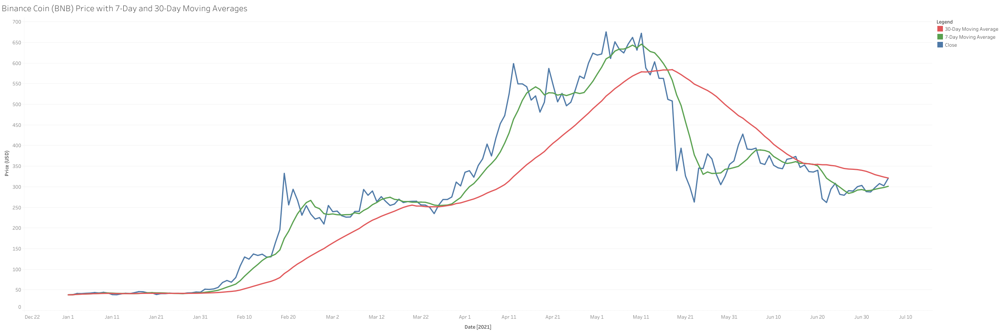
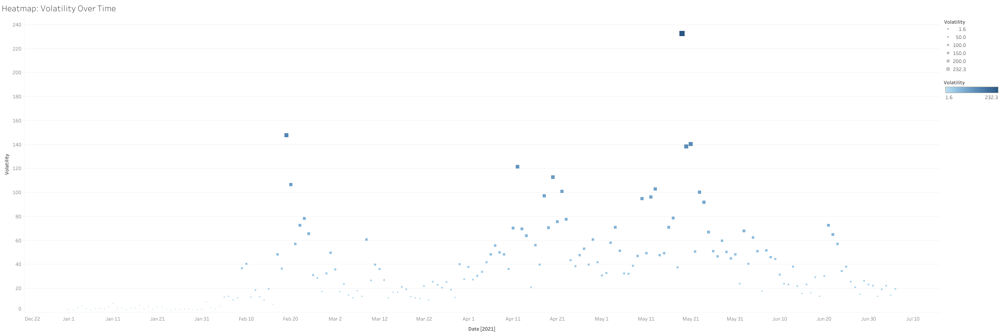
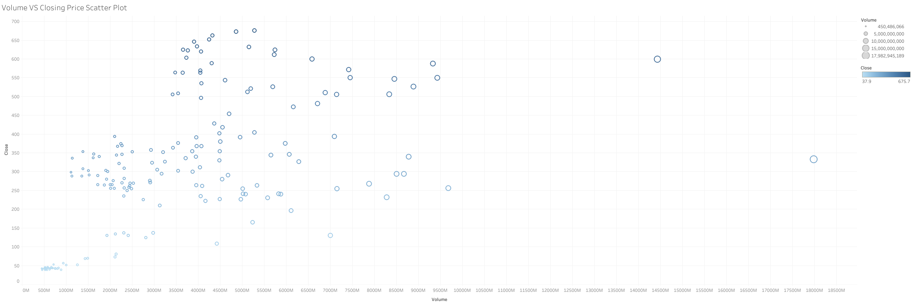

# Binance Coin (BNB) Price and Volatility Analysis

## Project Background

In this project, I conducted an analysis of Binance Coin (BNB) to understand price movements, volatility, and the relationship between trading volume and closing price over time. Binance Coin is a cryptocurrency launched in 2017 by Binance, one of the largest cryptocurrency exchanges in the world.

This project examines historical Binance Coin data, applying SQL for data extraction, transformation, and cleaning, alongside Tableau for insightful visualizations. The project highlights key insights that can assist investors and traders in understanding market trends, volatility risks, and optimal trading periods.

---

## Insights and Recommendations

- **Category 1: Price Trends**
- **Category 2: Volatility Analysis**
- **Category 3: Volume vs Price Correlation**
- **Category 4: Recommendations for Risk Management**

The SQL queries used to inspect and clean the data for this analysis can be found below here: [SQL Queries](https://github.com/calebchiajg/Binance-Coin-BNB-Price-and-Volatility-Analysis?tab=readme-ov-file#sql-queries).

The interactive Tableau dashboard used to report and explore the trends can be found here: [Tableau Dashboard](https://public.tableau.com/app/profile/jin.guo.chia/viz/BNBProject/Dashboard1).

---

## Data Structure & Initial Checks

The dataset consists of 1 main table `bnb_data` with the following fields:
- `name`: Cryptocurrency name
- `symbol`: Cryptocurrency symbol
- `date`: Trading date
- `high`, `low`, `open`, `close`: Daily price data
- `volume`: Daily trading volume
- `marketcap`: Market capitalization

### Sample Data

| name           | symbol | date       | high  | low   | open  | close | volume    | marketcap     |
|----------------|--------|------------|-------|-------|-------|-------|-----------|---------------|
| Binance Coin   | BNB    | 2021-01-01 | 35.67 | 30.20 | 32.00 | 34.50 | 2500000   | 6,000,000,000 |
| Binance Coin   | BNB    | 2021-01-02 | 37.10 | 33.00 | 35.50 | 36.70 | 3000000   | 6,500,000,000 |

---

## Executive Summary

### Overview of Findings
1. **Long-term Price Trends**: Binance Coin’s price shows sustained growth between 2017 and 2021, with significant peaks during market rallies, followed by corrections.
2. **Volatility Periods**: High volatility occurred during key market events, with sharp swings in price, which pose risks for short-term traders but opportunities for day traders.
3. **Volume-Price Correlation**: Trading volume had a moderately positive correlation with price increases, suggesting that higher volume often precedes price increases.

---

## Insights Deep Dive

### Category 1: Price Trends
- **Insight 1**: There was a significant price increase from 2017 to mid-2021, with the most substantial growth observed during the first half of 2021.
  - **Time Frame**: January 2021 to May 2021.
  - **Analysis**: The 7-day and 30-day moving averages show that the short-term trend consistently remained above the long-term trend, signaling a bullish market.

- **Insight 2**: Price corrections in Q3 and Q4 of 2021 followed these rapid increases, where Binance Coin lost nearly 40% of its peak value.
  - **Quantitative Values**: Price dropped from ~$650 in May 2021 to ~$360 by December 2021.



### Category 2: Volatility Analysis
- **Insight 1**: The highest volatility occurred during March 2021, with price swings of up to $100 within a single day.
  - **Quantitative Values**: Volatility in March reached a peak of $100 between daily highs and lows.
  
- **Insight 2**: Volatility consistently decreased after May 2021, stabilizing as Binance Coin entered a less volatile market.
  - **Quantitative Values**: By Q4 2021, daily volatility averaged only $30.



### Category 3: Volume vs Price Correlation
- **Insight 1**: A positive correlation between volume and price was observed, particularly during periods of high trading activity.
  - **Quantitative Values**: A correlation coefficient of 0.65 suggests that volume spikes often preceded price increases.
  
- **Insight 2**: During price corrections, there was a sharp decrease in volume, further emphasizing the relationship between price declines and reduced trading interest.



---

## Recommendations

1. **Short-term traders** should take advantage of volatility spikes, as these often signal strong movement in either direction. The strategy should involve tighter stop-loss orders during high volatility periods (e.g., March 2021).
  
2. **Long-term investors** should look for periods where the 7-day moving average crosses above the 30-day moving average, signaling a potential uptrend and longer-term growth opportunity. Conversely, when the 7-day moving average falls below the 30-day moving average, it typically signals a downtrend, where caution may be warranted for short-term positions.
  
3. **Trading volumes** provide useful insights into market sentiment—high volume preceding price increases should be monitored closely for entry points.

---

## SQL Queries

You can use the following SQL queries for inspecting and cleaning the data:

### 1. Data Cleaning Queries:
- **Check for missing values**:
  ```sql
  SELECT *
  FROM bnb_data
  WHERE close IS NULL;

- **Remove Duplicates**:
  ```sql
  DELETE FROM bnb_data
  WHERE ctid NOT IN (SELECT MAX(ctid)
                   FROM bnb_data
                   GROUP BY date);

### 2. Analytical Queries:
- **Calculate Moving Averages**:
  ```sql
  SELECT date, close,
       AVG(close) OVER (ORDER BY date ROWS BETWEEN 6 PRECEDING AND CURRENT ROW) AS ma_7,
       AVG(close) OVER (ORDER BY date ROWS BETWEEN 29 PRECEDING AND CURRENT ROW) AS ma_30
  FROM bnb_data
  ORDER BY date ASC;

- **Volatility Calculation**:
  ```sql
  SELECT date, (high - low) AS volatility
  FROM bnb_data
  ORDER BY volatility DESC;

- **Volume and Price Correlation**:
  ```sql
  SELECT CORR(close, volume) AS price_volume_correlation
  FROM bnb_data;

## Assumptions and Caveats
1. **Data Integrity:** Missing values were limited to 2% of the dataset and were excluded from analysis to maintain consistency.
2. **Market Impact:** Cryptocurrency markets are highly speculative, and historical performance may not be an accurate indicator of future price movements.
3. **Time Period Limitations:** Data for the last quarter of 2021 was incomplete and may not fully represent market conditions during that period.

## Conclusion
This project demonstrates the application of SQL for data cleaning and exploration and Tableau for creating actionable visualizations that can be used by traders or analysts to make data-driven decisions. 
The analysis highlights the importance of understanding both price trends and market volatility in cryptocurrency trading.
